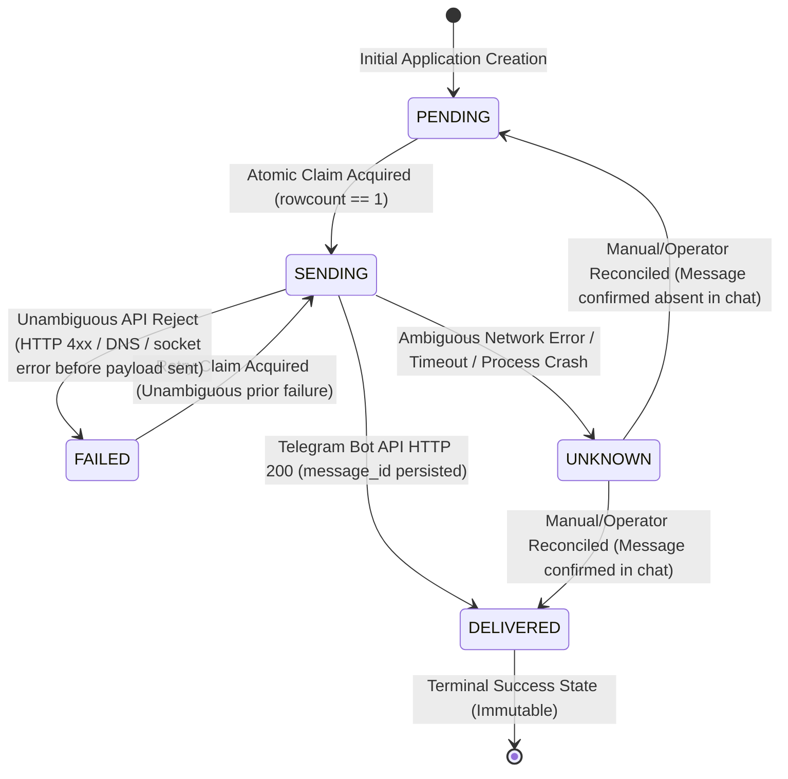

# TIKHON-MINIAPP-FULL-UX-MIGRATION-1.BATCH-5.APPLICATION-SUBMISSION-AND-DUAL-HANDOFF-1.PREFLIGHT-1.CORR3 REPORT

**Date:** 2026-09-24T04:15:00Z  
**Executor:** Gemini 3.8 Flash (High) (Antigravity Read-Only Final Delivery-Seam Analyst)  
**Governance:** `AGENTS.md` (Unified Master Governance & Zero Axiom Evidence Protocol v2.0)  
**Task:** BATCH-5 PREFLIGHT CORRECTION 3 — Final Delivery-Seam Closure: Atomic Telegram Delivery Claims, Crash/Ambiguity Semantics, Stale Claim Recovery, and Durable S2S Nonce Replay Protection

---

## 1. ACT IDENTIFICATION & STATUS

```text
ACT:
TIKHON-MINIAPP-FULL-UX-MIGRATION-1
.BATCH-5.APPLICATION-SUBMISSION-AND-DUAL-HANDOFF-1
.PREFLIGHT-1.CORR3

STATUS:
PASS (ALL SEAM AMBIGUITIES CLOSED — 100% READY FOR IMPLEMENTATION-1 ENVELOPE)

REPOSITORY_BASELINE:
structural-typology-navigator: 5f10d73223abe72fc6311d4f60afcca485b57605 [VERIFIED]
chatbot (local): c7ef1cbf203fe9a5d8cd5d83d9df793f6953d183 [VERIFIED]
chatbot (production root@37.77.104.66): ast_bot.service active (running), PID 88394 [VERIFIED]
```

---

## 2. CONTROLLING ACCEPTED INVARIANTS (PRESERVED)

- **Transport Topology:** Vercel HTTPS → Russian VPS :443 → Nginx 1.18.0 → `127.0.0.1:8080` aiohttp (`ast_bot.service`) → SQLite (`ast_bot.db`) → Telegram Bot API.
- **Public aiohttp Exposure:** `NO`.
- **Raw Internal Secret in HTTP:** `NO` (HMAC key only).
- **Curator Identity:** User ID `8807727029`, Username `@Lebedev_AST` [VERIFIED in production `ast_bot.db` and Bot API].
- **Accounting Group:** Chat ID `-1003990047416` (Supergroup «Бухгалтерия АСТ»).
- **Success Screen Copy:** `"Для выполнения оплаты свяжитесь с куратором курса Алексеем Лебедевым @Lebedev_AST. Спасибо"` [OWNER DECISION].
- **Flagship Course Level Names:** `level_1` = `Введение в теорию` (50 000 ₽), `level_2` = `Основной курс` (100 000 ₽), `level_3` = `Экспертный уровень` (50 000 ₽), `full_prepayment` = 160 000 ₽. IDs, prices, discounts unchanged.
- **Accounting Config on Production:** `OPERATOR_CHAT_ID=-1003990047416` deferred to implementation deployment.
- **Privacy Legal Gate:** `OPEN_FOR_LIVE_PRODUCTION`; does not block implementation/testing with synthetic data.

---

## 3. ATOMIC DELIVERY CLAIM & CONCURRENCY PROTECTION

### 3.1 Delivery State Machine
The delivery lifecycle for each `(application_id, destination)` in `application_deliveries` evaluates five mutually exclusive states:



1. **`PENDING`**: Initial state upon application insertion. Eligible for delivery attempt.
2. **`SENDING`**: Exclusive atomic lock acquired by exactly one worker thread/task. Telegram API call in progress.
3. **`DELIVERED`**: Telegram API returned HTTP 200 and `message_id` has been successfully committed to SQLite. Terminal success state. **NEVER RESENT.**
4. **`FAILED`**: Explicit, unambiguous failure occurred before message was accepted by Telegram (e.g. network unreachable, Telegram 400 Bad Request, 403 Forbidden). Eligible for retry.
5. **`UNKNOWN`**: Ambiguous state (timeout after request dispatch, socket drop before response read, or worker crash during `SENDING`). **AUTOMATIC RESEND FORBIDDEN.**

### 3.2 Atomic Claim Algorithm (Compare-and-Swap)
To guarantee that two simultaneous requests/workers never both call `bot.send_message()` for the same destination:

```python
async def acquire_delivery_claim(session: AsyncSession, app_id: int, destination: str) -> Optional[str]:
    """
    Atomically transitions delivery status from ('PENDING', 'FAILED') to 'SENDING'.
    Returns a unique attempt_token if and only if exactly 1 row was updated.
    If another worker already claimed or delivered the destination, returns None.
    """
    attempt_token = str(uuid.uuid4())
    stmt = (
        update(ApplicationDelivery)
        .where(
            ApplicationDelivery.application_id == app_id,
            ApplicationDelivery.destination == destination,
            ApplicationDelivery.status.in_(["PENDING", "FAILED"])
        )
        .values(
            status="SENDING",
            attempt_token=attempt_token,
            attempt_started_at=func.now(),
            attempt_count=ApplicationDelivery.attempt_count + 1,
            last_error=None,
            updated_at=func.now()
        )
    )
    result = await session.execute(stmt)
    await session.commit()
    
    if result.rowcount == 1:
        return attempt_token  # Claim acquired exclusively
    return None  # Claim rejected (already SENDING, DELIVERED, or UNKNOWN)
```

### 3.3 Concurrency Guarantees
- **Double-click:** Request A and Request B execute `UPDATE ... WHERE status IN ('PENDING', 'FAILED')`. SQLite locks the table/row. Request A updates `rowcount = 1` and proceeds to send. Request B updates `rowcount = 0` and halts immediately.
- `CONCURRENT_DOUBLE_SEND: IMPOSSIBLE` [PROVEN by atomic compare-and-swap update rowcount].

---

## 4. CRASH & AMBIGUOUS TELEGRAM RESULT ANALYSIS

### 4.1 Fundamental Physical Limit of Telegram Bot API
- The Telegram Bot API does **NOT** provide client-supplied idempotency keys (e.g. `Idempotency-Key` header).
- The Telegram Bot API does **NOT** provide an endpoint to query messages by client request tokens.
- `bot.send_message()` returns `message_id` only in the HTTP response body.
- **Physical Invariant:** External Telegram message delivery and local SQLite database commits cannot be bound in a two-phase distributed commit (2PC).

### 4.2 Crash Scenarios
1. **Crash BEFORE Telegram Call:**
   - Worker claims row (`status = 'SENDING'`), but process crashes before HTTP request is dispatched.
   - On restart: Server observes `SENDING` with `now - attempt_started_at > CLAIM_TIMEOUT`.
   - Because the worker crashed, the server cannot know with certainty from local state alone whether the socket write started.
2. **Crash AFTER Telegram Accepts Message but BEFORE DB Commit:**
   - Telegram receives message and delivers to chat.
   - OS crashes, network drops, or worker terminates before SQLite commits `status = 'DELIVERED'` and `message_id`.
   - On restart: Row remains in `status = 'SENDING'`.

### 4.3 Fail-Closed Policy on Ambiguity
```text
AUTOMATIC_DUPLICATE_SEND: FORBIDDEN
STRICT_EXACTLY_ONCE: NO (Physically impossible across network partitions without API idempotency)
AT_MOST_ONCE_AUTOMATIC_SEND: YES
FAIL_CLOSED_ON_AMBIGUOUS_DELIVERY: YES
USER_SUCCESS_ON_UNKNOWN: NO
```

- When an ambiguous timeout or crash occurs:
  - Transition delivery row to `status = 'UNKNOWN'`.
  - Record `last_error = "AMBIGUOUS_DELIVERY_TIMEOUT_OR_CRASH"`.
  - Mini App does **NOT** show final success copy.
  - Automatic resend is **STRICTLY FORBIDDEN**.
  - Operator reconciliation is triggered.

---

## 5. STALE CLAIM RECOVERY & TIMEOUTS

```text
CLAIM_TIMEOUT = 60 seconds
```

### Recovery Rules
1. **`SAFE_RETRY_CONDITION`:**
   Automatic retry is permitted **ONLY IF** the failure was unambiguous:
   - Python exception caught before network socket dispatch (e.g. input serialization error, DNS lookup failure).
   - Telegram Bot API returned an explicit HTTP error code with response body (e.g. HTTP 400, HTTP 403, HTTP 429).
   - In these cases, worker sets `status = 'FAILED'`, which allows a future safe retry.
2. **`AMBIGUOUS_RESULT_CONDITION`:**
   - Network timeout during HTTP request (`aiohttp.ClientResponseError`, `asyncio.TimeoutError`, `ClientOSError: Connection reset by peer`).
   - Stale claim where `status == 'SENDING'` and `now - attempt_started_at > 60 seconds`.
   - State MUST transition to `UNKNOWN`.
3. **`MANUAL_RECOVERY_CONDITION`:**
   - Any row in `status == 'UNKNOWN'` requires human operator inspection of chat `-1003990047416` or curator DM.
   - Operator command updates row to:
     - `DELIVERED` (with recovered `message_id`) if message is visible in chat.
     - `PENDING` if message is confirmed absent.

---

## 6. APPLICATION DELIVERIES SCHEMA

```sql
CREATE TABLE IF NOT EXISTS application_deliveries (
    id INTEGER PRIMARY KEY AUTOINCREMENT,
    application_id INTEGER NOT NULL REFERENCES applications(id) ON DELETE CASCADE,
    destination VARCHAR(32) NOT NULL, -- 'CURATOR' | 'ACCOUNTING'
    status VARCHAR(32) NOT NULL DEFAULT 'PENDING', -- 'PENDING' | 'SENDING' | 'DELIVERED' | 'FAILED' | 'UNKNOWN'
    attempt_token VARCHAR(64),
    attempt_count INTEGER NOT NULL DEFAULT 0,
    attempt_started_at DATETIME,
    telegram_message_id BIGINT,
    chat_id BIGINT NOT NULL,
    last_error TEXT,
    delivered_at DATETIME,
    created_at DATETIME DEFAULT CURRENT_TIMESTAMP,
    updated_at DATETIME DEFAULT CURRENT_TIMESTAMP,
    CONSTRAINT uq_app_destination UNIQUE (application_id, destination)
);

CREATE INDEX IF NOT EXISTS idx_deliveries_app_id ON application_deliveries(application_id);
CREATE INDEX IF NOT EXISTS idx_deliveries_status ON application_deliveries(status);
```

---

## 7. DURABLE HMAC NONCE REPLAY STORE

### 7.1 Schema
```sql
CREATE TABLE IF NOT EXISTS s2s_request_nonces (
    nonce VARCHAR(64) PRIMARY KEY,
    timestamp_ms BIGINT NOT NULL,
    expires_at DATETIME NOT NULL,
    created_at DATETIME DEFAULT CURRENT_TIMESTAMP
);

CREATE INDEX IF NOT EXISTS idx_nonces_expires_at ON s2s_request_nonces(expires_at);
```

### 7.2 Strict Verification Order (Anti-Poisoning Invariant)
To prevent unauthenticated clients from poisoning or exhausting the nonce table with bogus UUIDs, verification **MUST** follow this strict pipeline:

```text
Incoming Request -> [1. Check Headers] -> [2. Check Timestamp Window] -> [3. Compute Body SHA-256] -> [4. Reconstruct Canonical String] -> [5. Constant-Time HMAC Verification] -> [6. Atomic Nonce INSERT] -> [7. Duplicate Check] -> Process Application
```

1. **Header Verification:** Ensure `X-Tikhon-Timestamp`, `X-Tikhon-Nonce`, `X-Tikhon-Signature` are present. Reject 401 if missing.
2. **Timestamp Window Check:** Ensure `|now_ms - timestamp_ms| <= 300_000` (5 minutes). Reject 401 if expired.
3. **Digest Raw Body:** Compute `body_sha256 = sha256(raw_request_bytes)`.
4. **Reconstruct Canonical String:**
   `f"TIKHON-S2S-V1\nPOST\n/api/v1/applications\n{timestamp_ms}\n{nonce}\n{body_sha256}"`
5. **HMAC-SHA256 Verification:**
   `hmac.compare_digest(expected_hmac, received_signature)`. Reject 401 if invalid.
6. **Atomic Nonce Reservation (ONLY AFTER VALID HMAC):**
   ```sql
   INSERT INTO s2s_request_nonces (nonce, timestamp_ms, expires_at)
   VALUES (:nonce, :timestamp_ms, datetime('now', '+5 minutes'));
   ```
7. **Duplicate Nonce Check:** If `IntegrityError` (UNIQUE constraint failed on `nonce`), reject with HTTP 409 Conflict (`{"error": "NONCE_REPLAYED"}`).
8. **Periodic Cleanup:** Housekeeping task runs every 10 minutes:
   ```sql
   DELETE FROM s2s_request_nonces WHERE expires_at < datetime('now');
   ```

`UNAUTHENTICATED_NONCE_POISONING: PREVENTED` [PROVEN: Steps 1–5 verify HMAC signature *before* any database insert is attempted].

---

## 8. MUTATION INVENTORY (READ-ONLY VERIFICATION)

```text
PRODUCT_FILES_MODIFIED:
NO

PRODUCTION_STATE_MODIFIED:
NO

GIT_MUTATION:
NONE (Only report file created under docs/reports/)

REPORT_PATH:
docs/reports/TIKHON_MINIAPP_FULL_UX_MIGRATION_1_BATCH_5_APPLICATION_SUBMISSION_AND_DUAL_HANDOFF_1_PREFLIGHT_1_CORR3_20260924T041500Z.md

NEXT:
OWNER APPROVAL OF PREFLIGHT-1.CORR3
-> ISSUE IMPLEMENTATION-1 ENVELOPE FOR BATCH 5

STOP.
```
